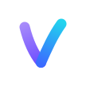
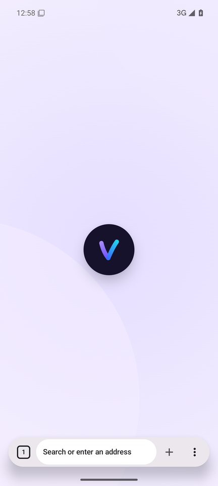
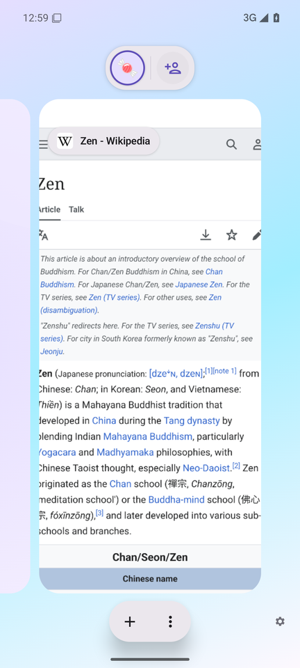
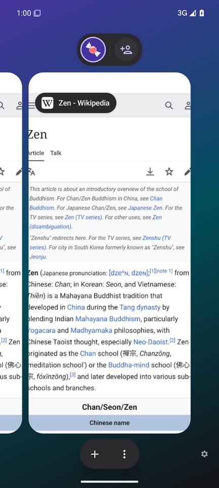
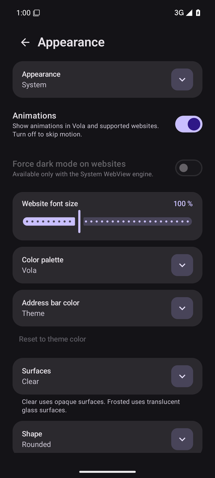

<p align="center">
  
</p>

<h1 align="center">Vola</h1>

<p align="center">
  <strong>Красивый, быстрый и приватный браузер для Android.</strong><br>
  <sub>A calm, private Android browser with a design inspired by Zen Browser.</sub>
</p>

<p align="center">
  
  
  
  <a href="LICENSE"></a>
</p>

<p align="center">
  
  &nbsp;
  
  &nbsp;
  
  &nbsp;
  
</p>

## Что такое Vola

Vola — браузер, в котором вокруг страницы нет ничего лишнего: плавающая адресная строка,
мягкие цвета, крупные скругления и пружинные анимации. Всё в духе Zen Browser и на базе
Material 3.

- **Красота без шума.** Собственная палитра Vola, тёмная и чистая OLED-тема, Material You по желанию.
- **Приватность по умолчанию.** Никакой телеметрии, аналитики и Google Play Services. Режим
  «Только HTTPS», локальная блокировка рекламы и трекеров, приватные вкладки ничего не пишут на диск.
- **Расширения Firefox.** Движок GeckoView поддерживает расширения Firefox, uBlock Origin установлен сразу.
- **Жесты.** Переключение вкладок свайпом по адресной строке, визуальный обзор вкладок, тактильная отдача.
- **Телефон и планшет**, интерфейс на русском и английском.

### Скоро

| | |
| --- | --- |
| **Пространства** | Отдельные наборы вкладок со своим названием, эмодзи и цветом |
| **Essentials** | Закреплённые сайты над обзором вкладок |
| **Компактный режим** | Страница на весь экран, панели появляются по жесту |
| **Split View** | Две вкладки рядом |
| **Темы** | Готовые темы и редактор акцента, скруглений и плотности |
| **Glance** | Предпросмотр ссылки по долгому тапу |

## Установка

Нужен Android 13 или новее на 64-битном ARM (arm64-v8a), то есть почти любой современный
телефон или планшет.

- **Релизы** появятся на странице [Releases](https://github.com/MikeSPL187/Browser/releases).
  Для автообновления добавьте адрес этого репозитория в [Obtainium](https://github.com/ImranR98/Obtainium).
- **Свежие сборки** каждого изменения — в разделе **Artifacts** соответствующего запуска на вкладке
  [Actions](https://github.com/MikeSPL187/Browser/actions). Сборка **Vola Preview** ставится
  отдельным приложением и не мешает основной.

| Сборка | Движок |
| --- | --- |
| Vola | GeckoView, расширения Firefox |
| Vola WebView | Android System WebView, меньше размер |

## Разработка

Kotlin, Jetpack Compose, Material 3 Expressive, JDK 17. Каждое изменение собирается и проверяется
в GitHub Actions. Правила проекта — в [`CLAUDE.md`](CLAUDE.md), документация по устройству кода —
в [`docs/`](docs/).

```bash
./gradlew testFullDebugUnitTest lintFullDebug   # тесты и lint
./gradlew assembleFullDebug                     # debug APK (GeckoView)
```

## Лицензия

[Mozilla Public License 2.0](LICENSE). Сторонние компоненты и списки фильтров распространяются под
своими лицензиями; перечень есть в приложении: **Настройки → О приложении**.
