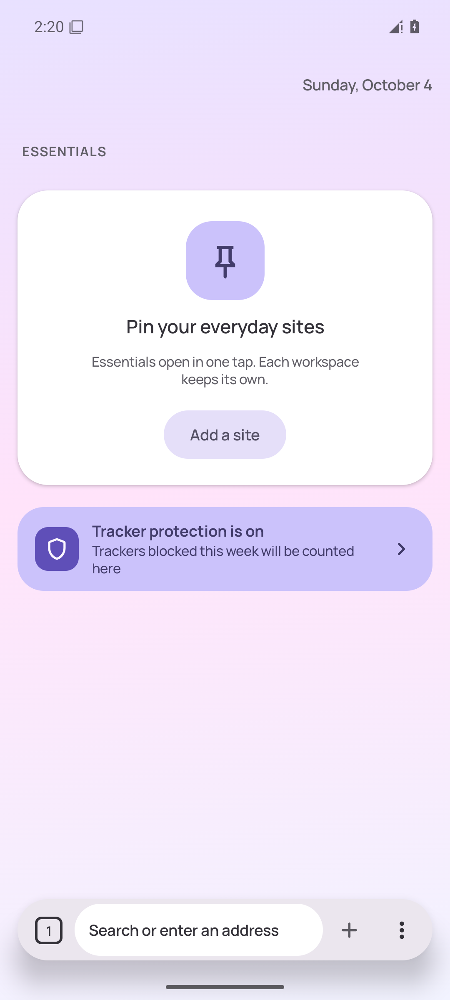
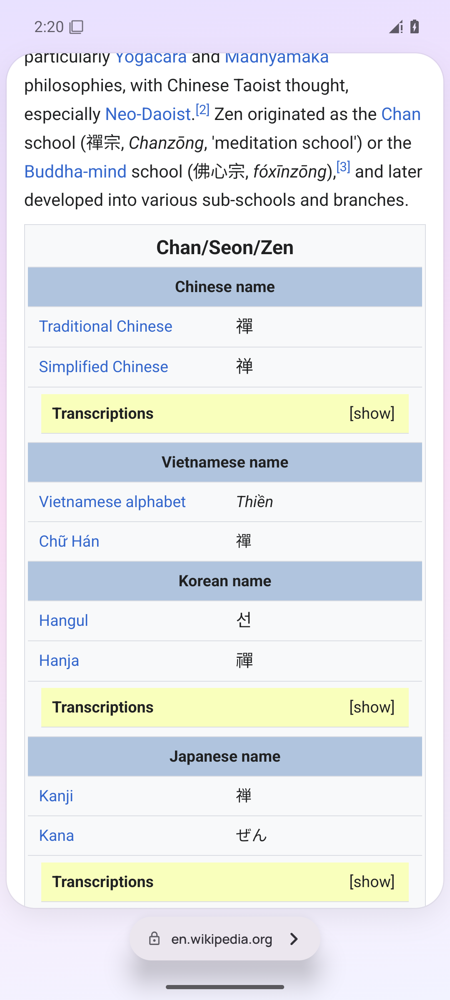
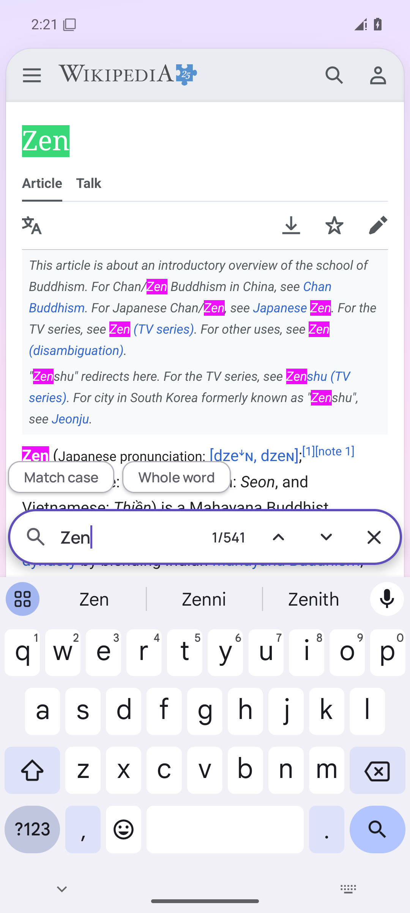
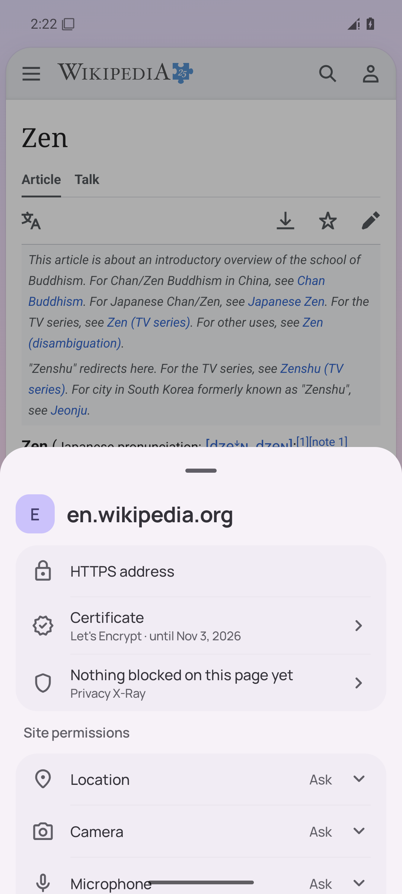
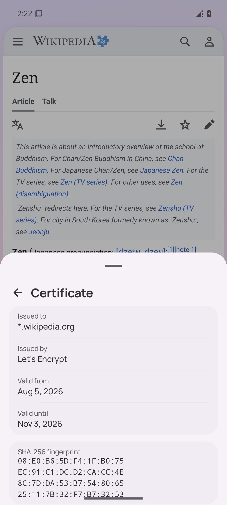
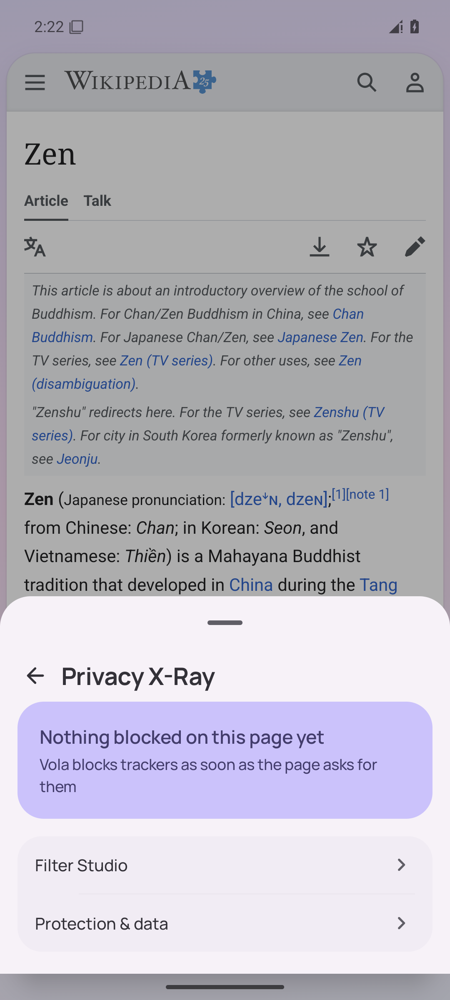
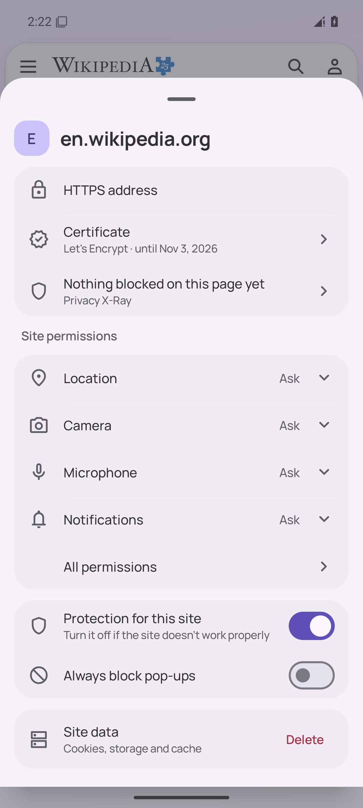
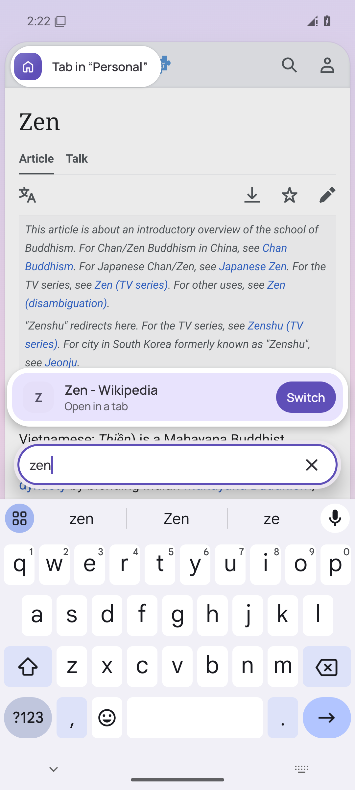
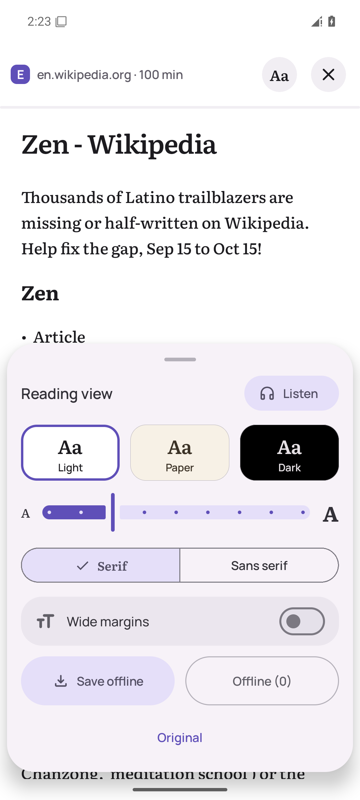
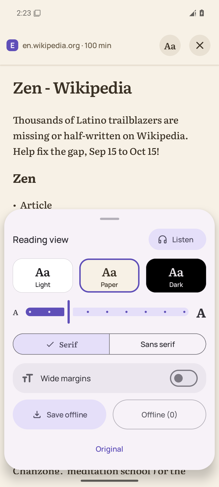

# Screenshots: ccr-a2577ace-hwz81e-q16c @ 6ca6662

## 01-launch

## 02-new-tab-light

## 03-page-light

## 04-page-scrolled-light

## 05-compact-mode-light

## 06-compact-mode-bar-light

## 07-find-light

## 08-site-info-light

## 09-site-certificate-light

## 10-site-info-xray-light

## 11-site-info-data-light

## 12-site-data-undo-light

## 13-address-light

## 14-reader-settings-light

## 15-reader-paper-light

## 16-reader-light

