# Screenshots: ccr-d3f28808-uk5drv @ 5cac2e4

## 01-launch

## 02-new-tab-light

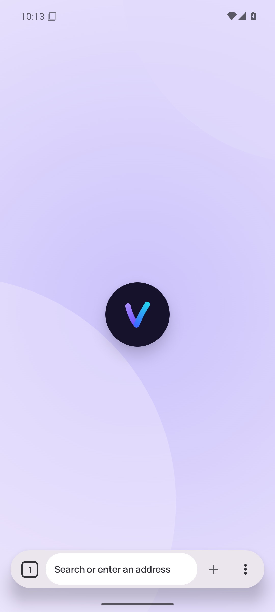

## 03-page-light

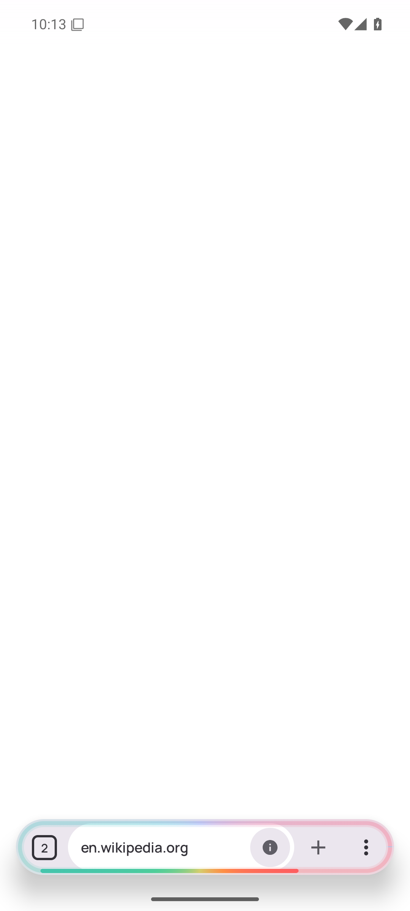

## 04-https-upgrade-light

## 05-https-only-early-light

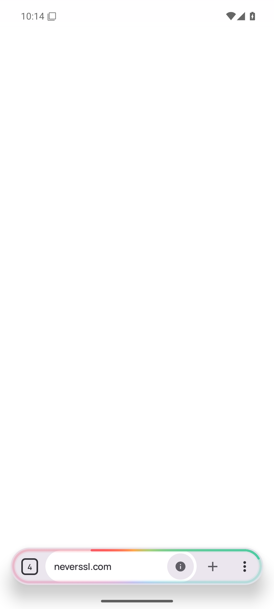

## 06-https-only-light

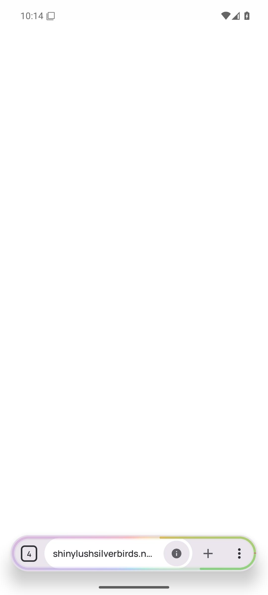

## 07-tab-overview-light

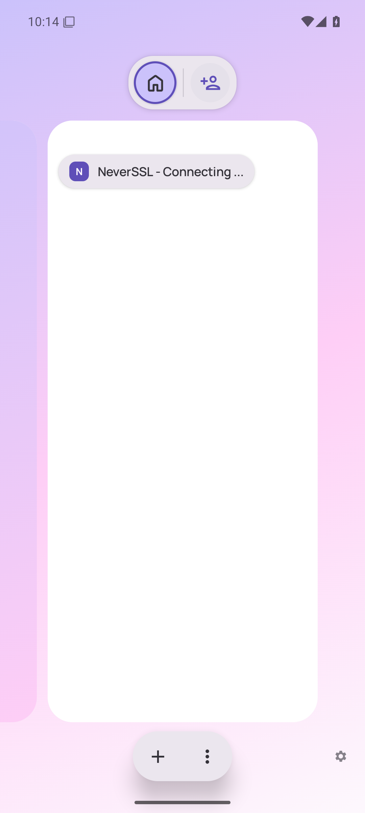

## 08-workspace-options-light

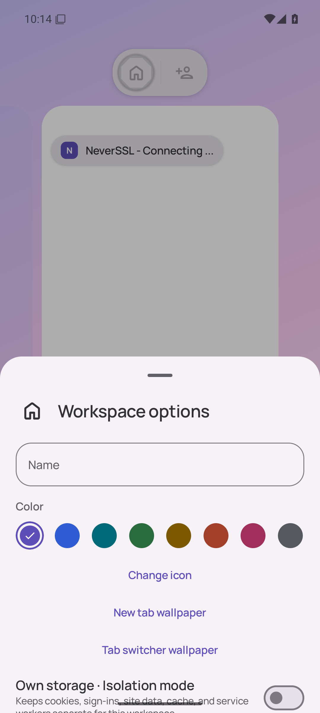

## 09-current-dark

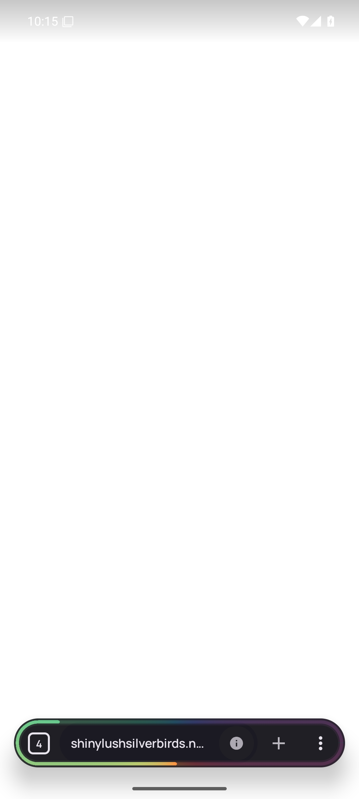

## 10-new-tab-dark

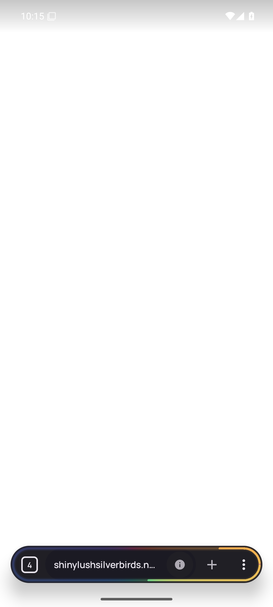

## 11-page-dark

## 12-https-upgrade-dark

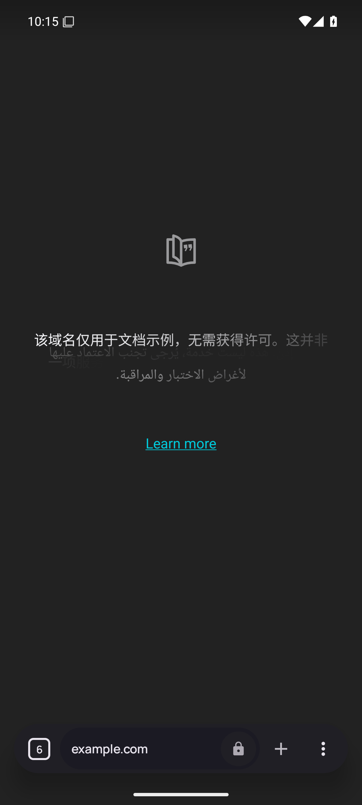

## 13-https-only-early-dark

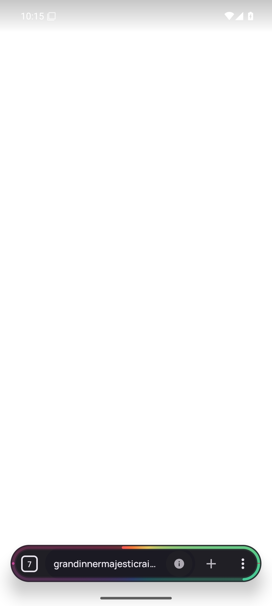

## 14-https-only-dark

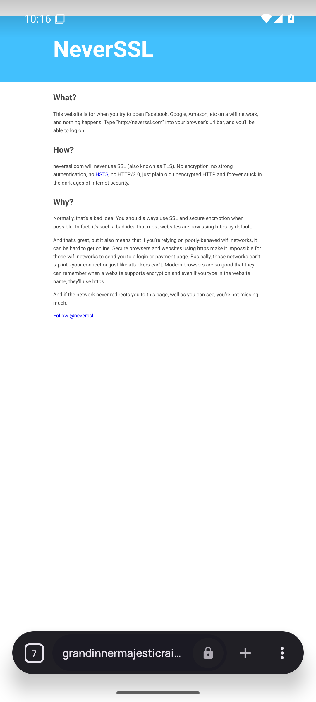

## 15-tab-overview-dark

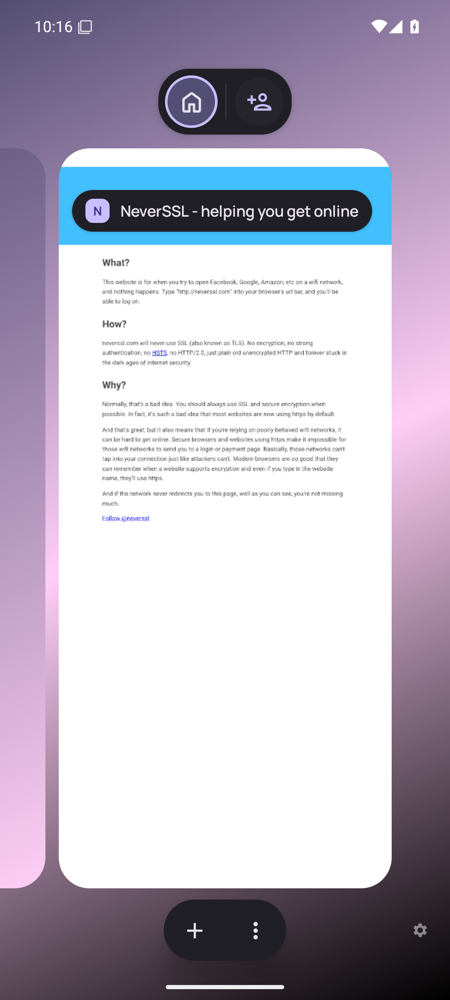

## 16-workspace-options-dark

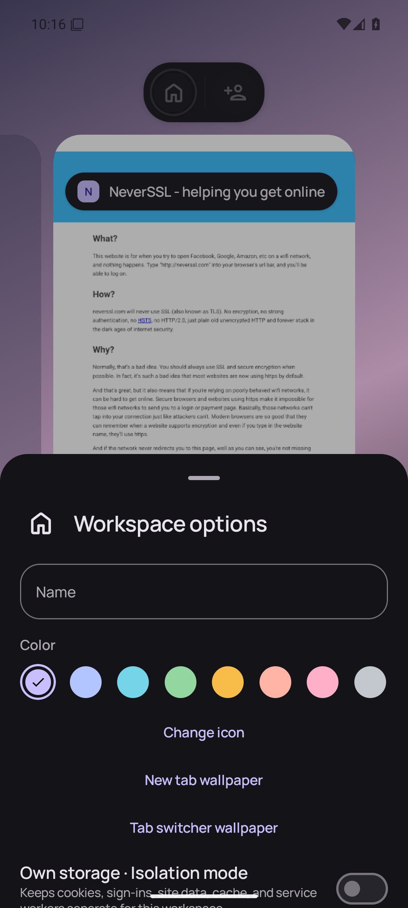

## 17-menu-dark

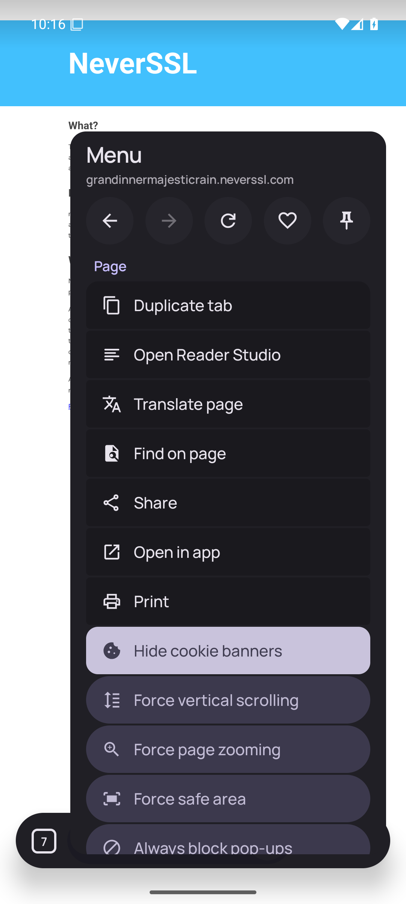

## 18-settings-dark

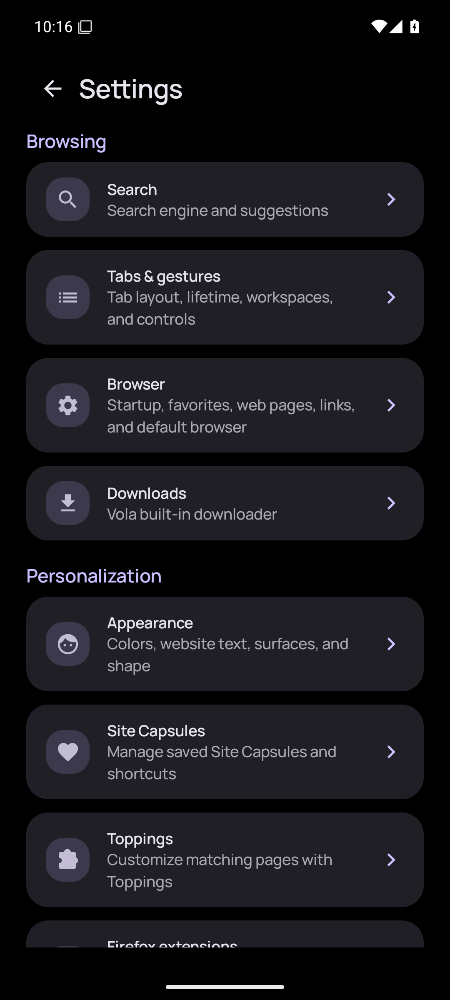

## 19-appearance-dark

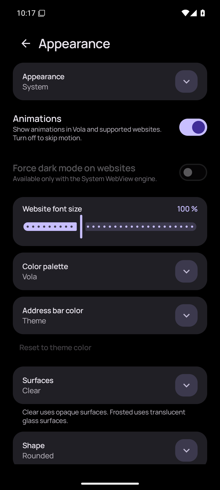

## 20-new-tab-ru

## 21-page-ru

## 22-https-upgrade-ru

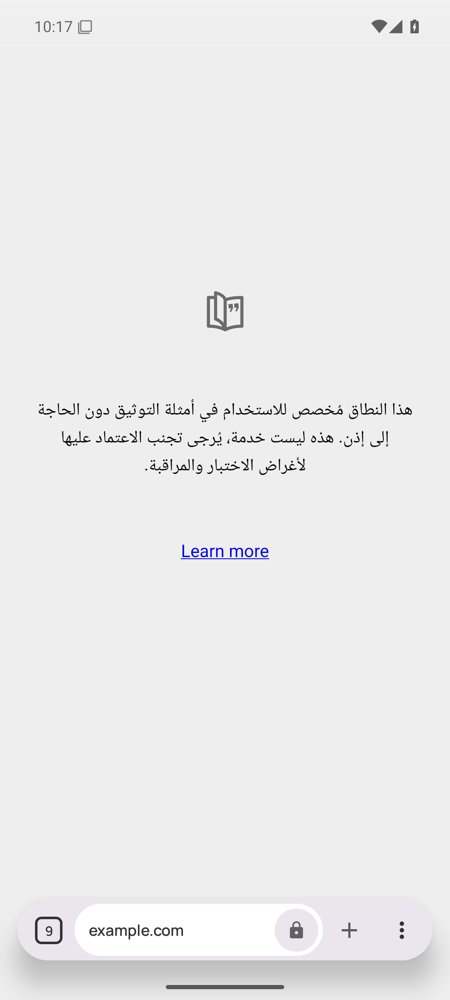

## 23-https-only-early-ru

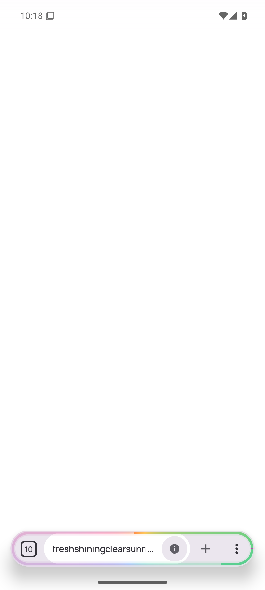

## 24-https-only-ru

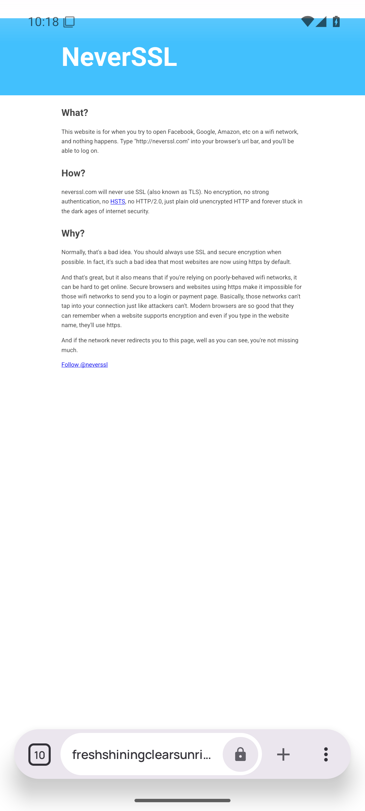

## 25-tab-overview-ru

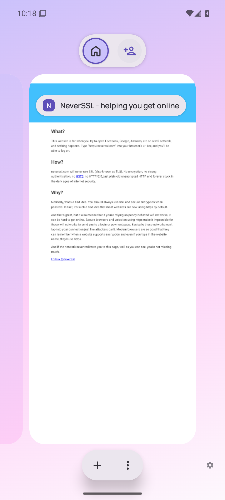

## 26-workspace-options-ru

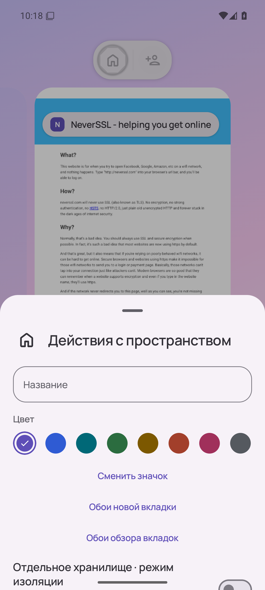

## 27-menu-ru

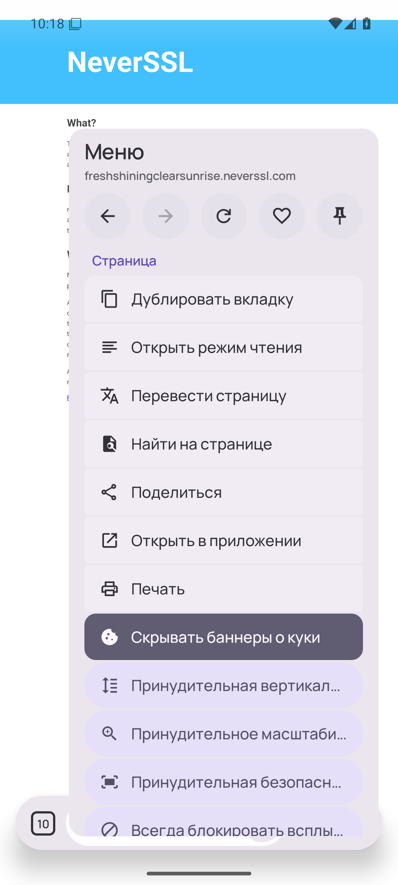

