# Screenshots: ci/screenshots @ 378a271

## 01-launch

## 02-new-tab-light

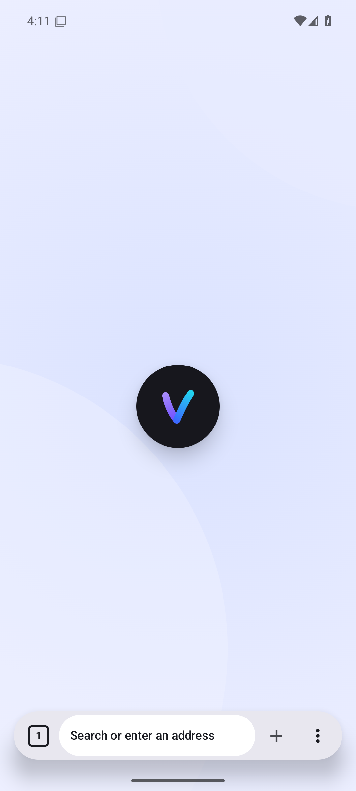

## 03-page-light

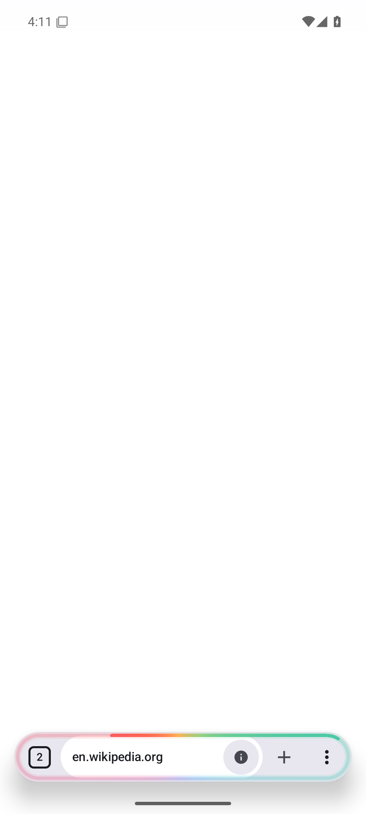

## 04-tab-overview-light

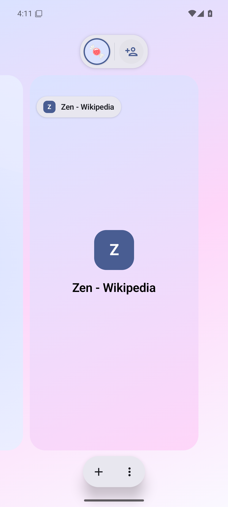

## 05-menu-light

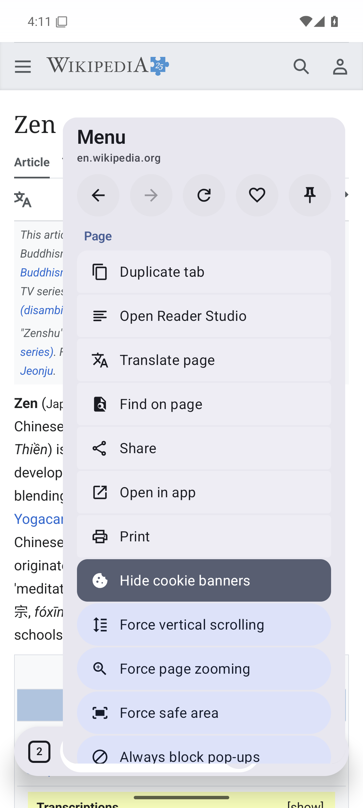

## 06-settings-light

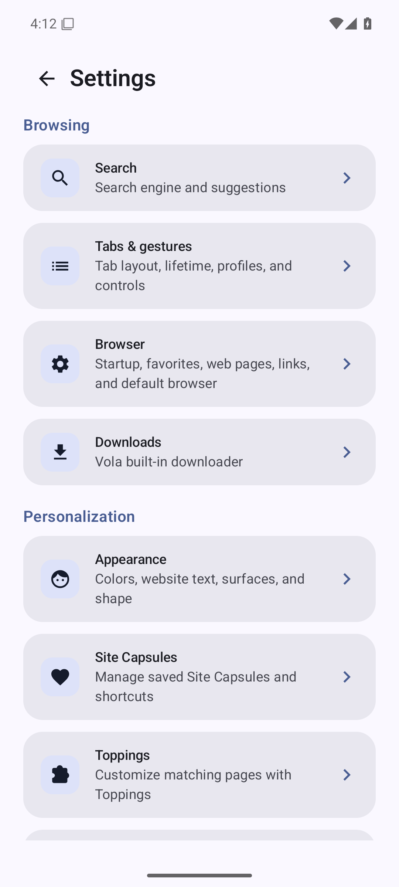

## 07-appearance-light

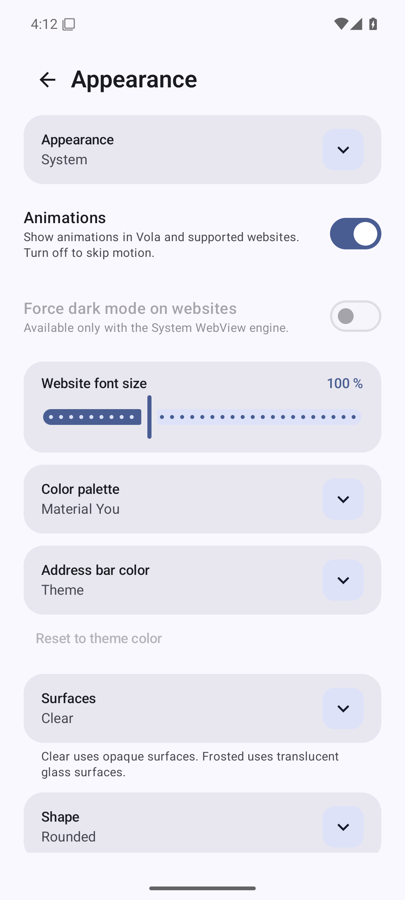

## 08-current-dark

## 09-new-tab-dark

## 10-page-dark

## 11-tab-overview-dark

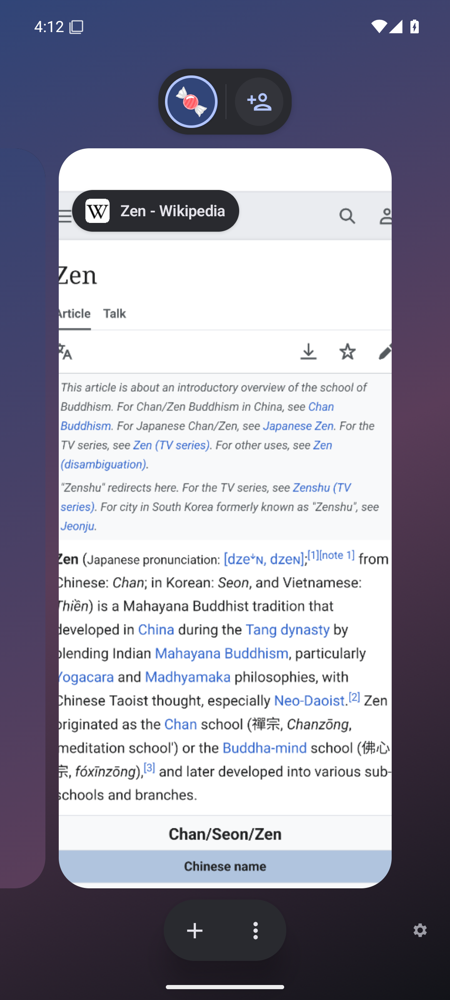

## 12-menu-dark

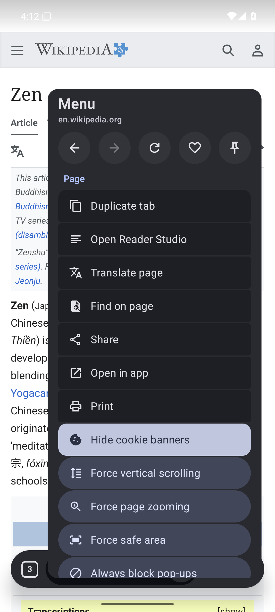

## 13-new-tab-ru

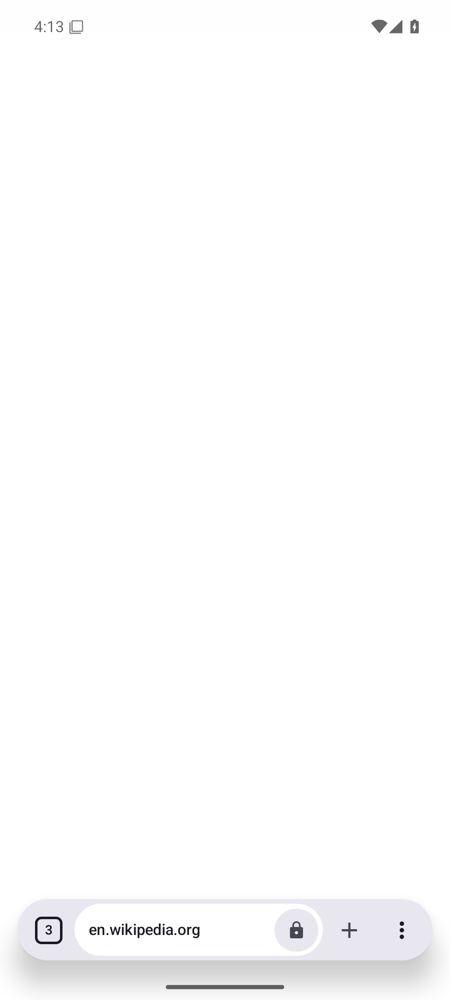

## 14-page-ru

## 15-tab-overview-ru

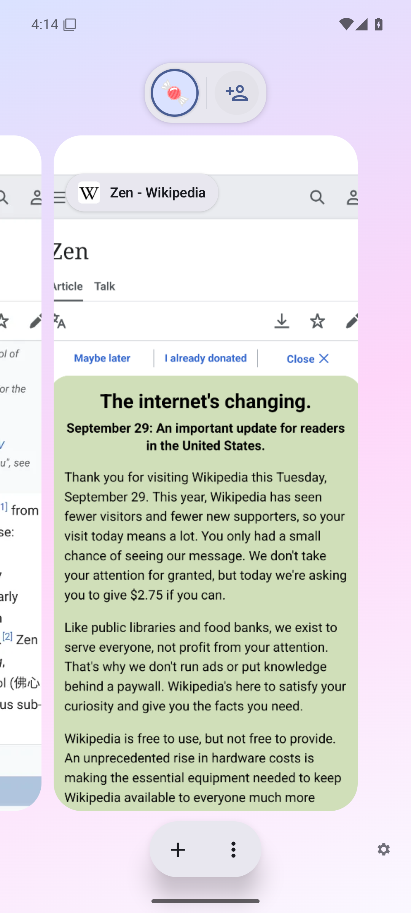

## 16-menu-ru

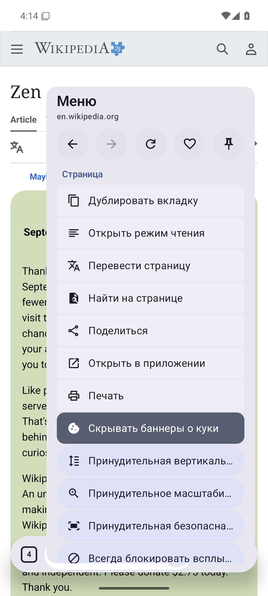

## 17-settings-ru

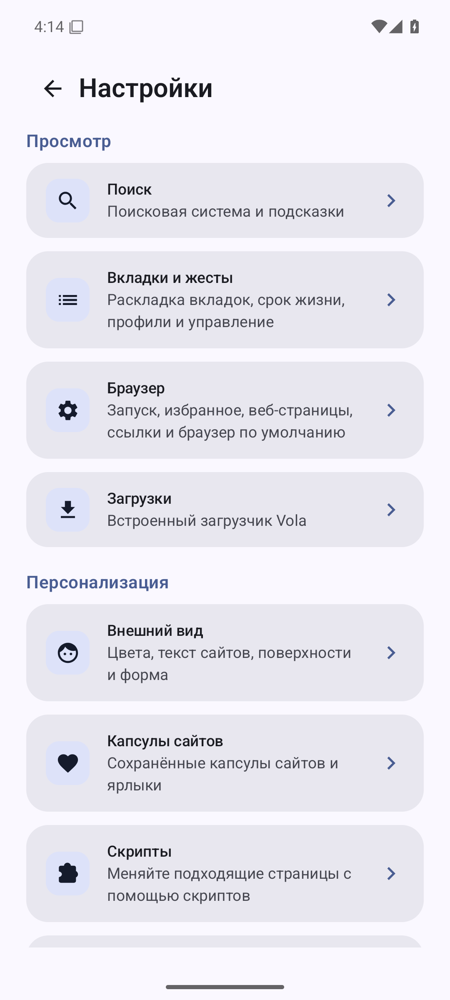

## 18-appearance-ru

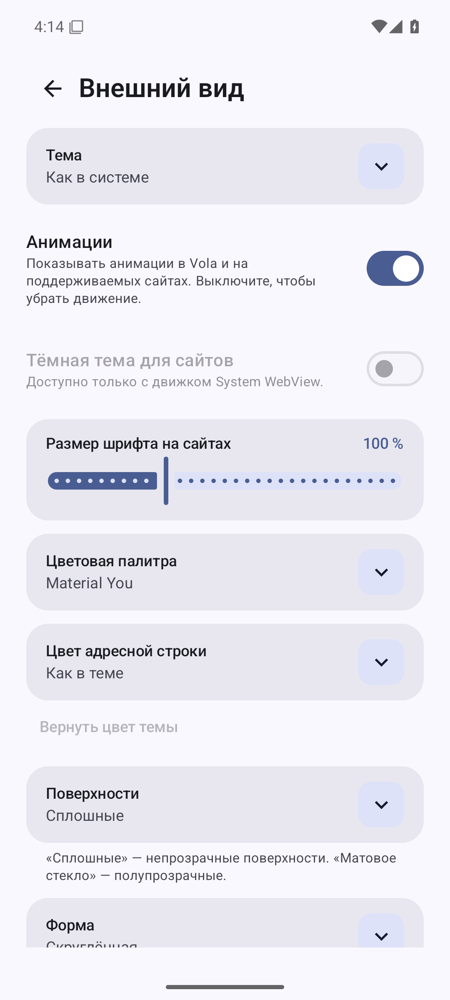

