# Screenshots: claude/q3b-tour-checks @ 1ee1786

## 01-launch

## 02-new-tab-light

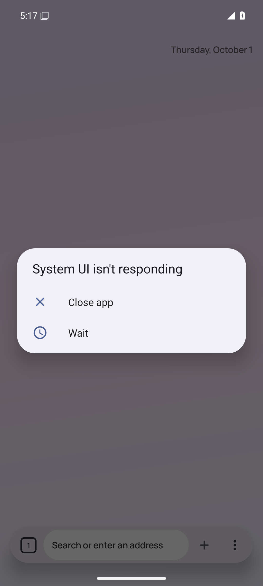

## 03-page-light

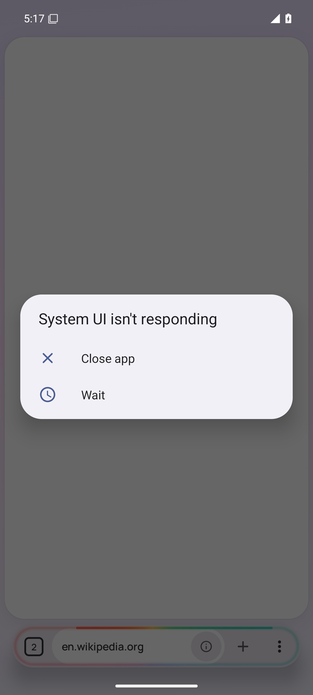

## 04-page-scrolled-light

## 05-https-upgrade-light

## 06-https-only-early-light

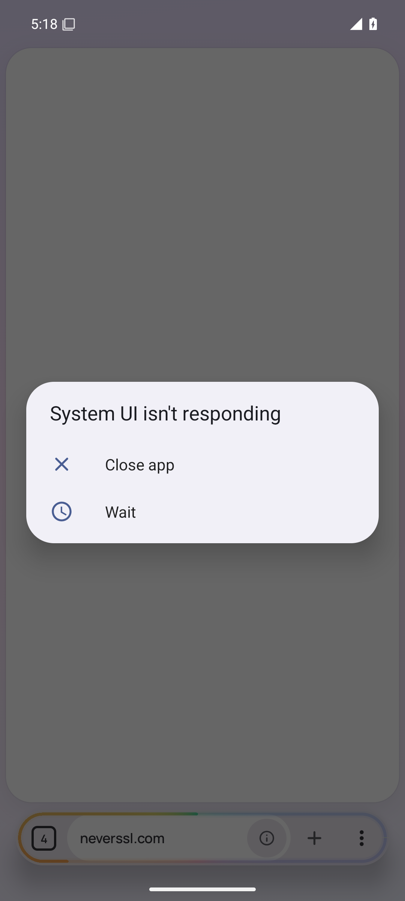

## 07-https-only-light

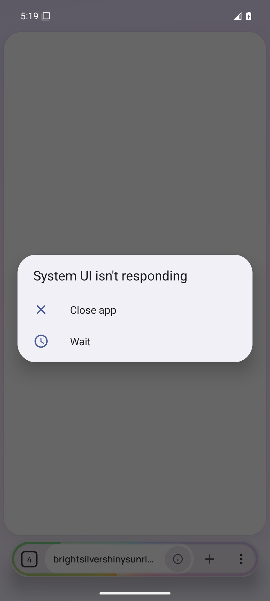

## 08-tab-overview-light

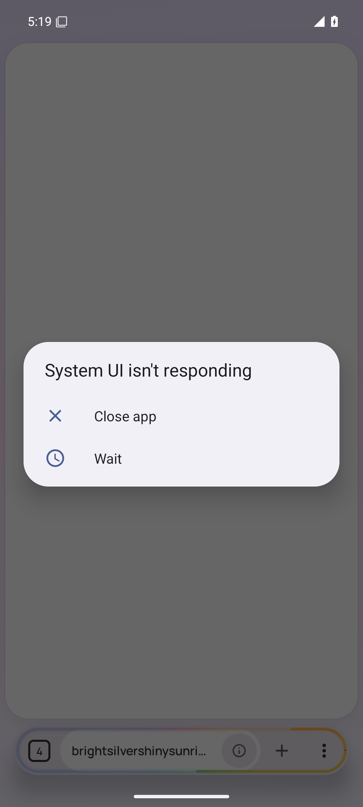

## 09-current-dark

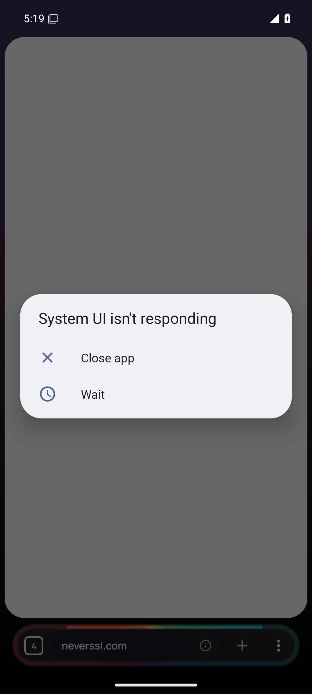

## 10-new-tab-dark

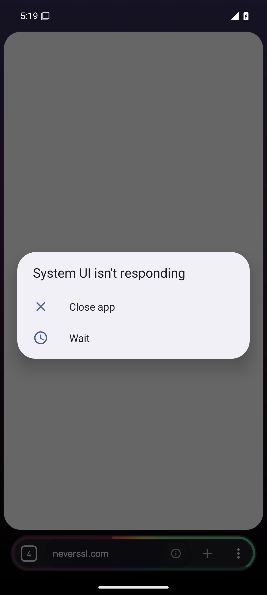

## 11-page-dark

## 12-page-scrolled-dark

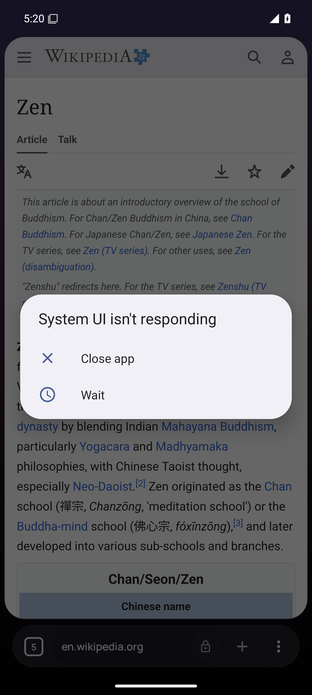

## 13-https-upgrade-dark

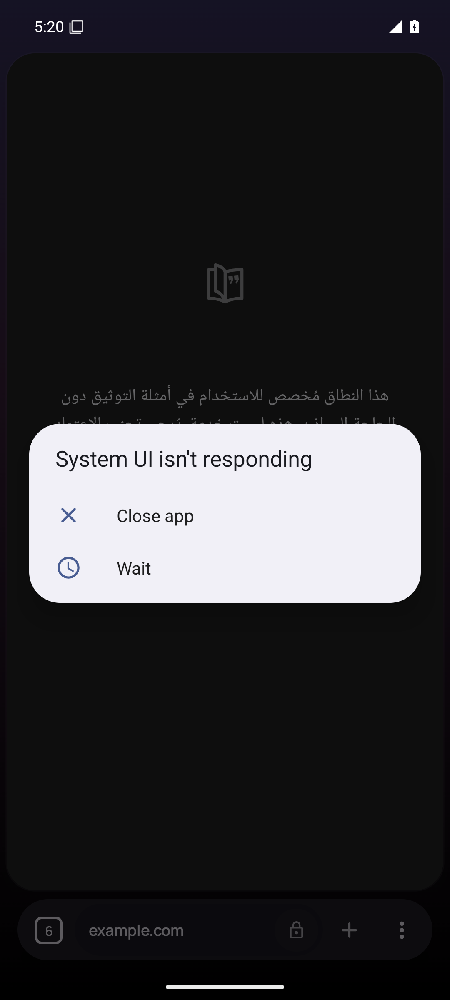

## 14-https-only-early-dark

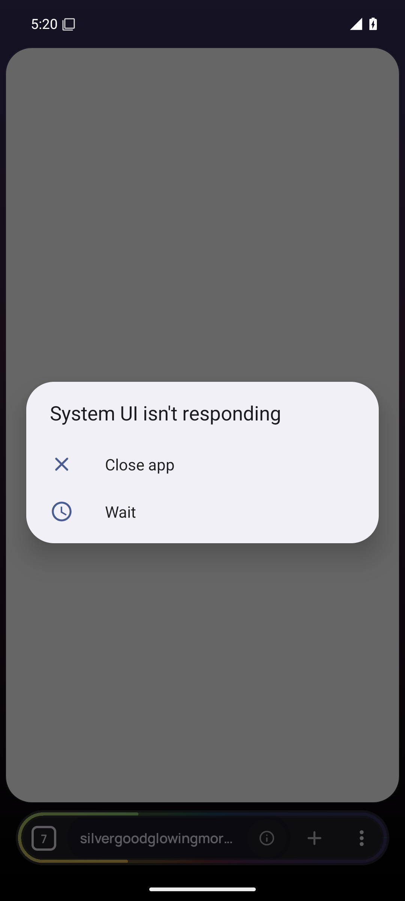

## 15-https-only-dark

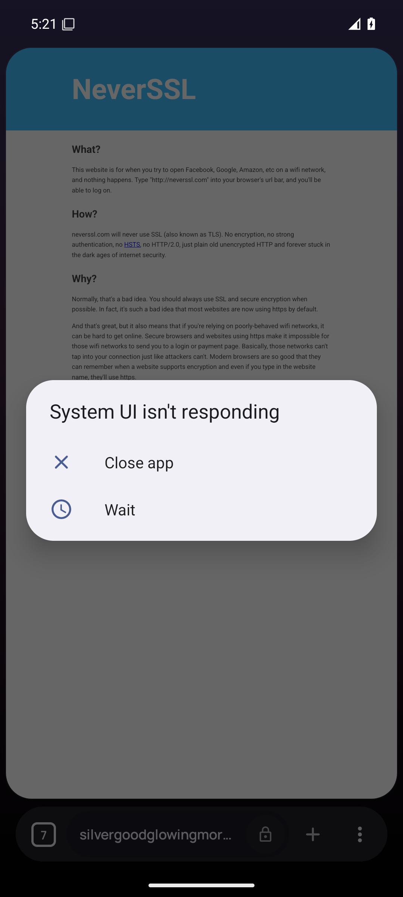

## 16-tab-overview-dark

## 17-new-tab-a11y

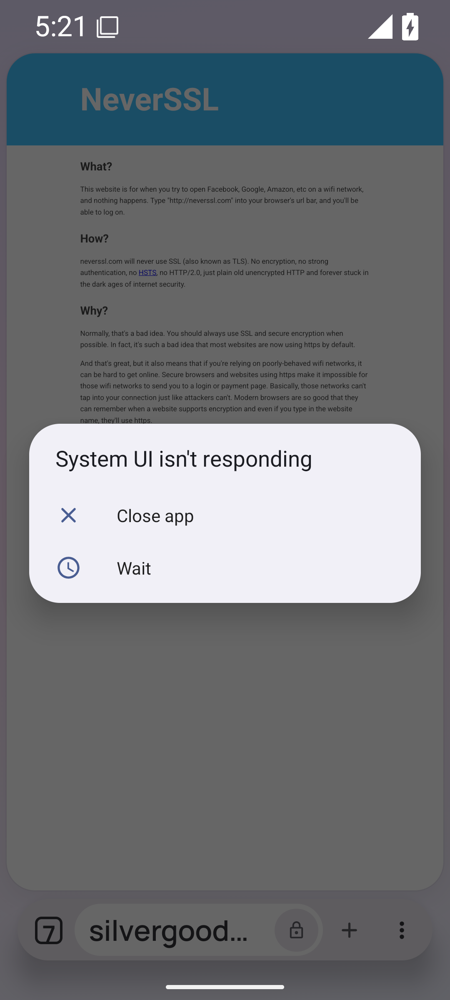

## 18-page-a11y

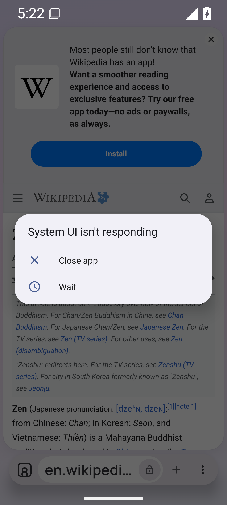

## 19-new-tab-ru

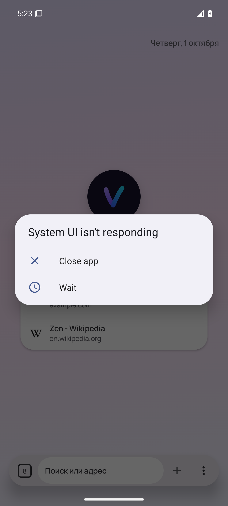

## 20-page-ru

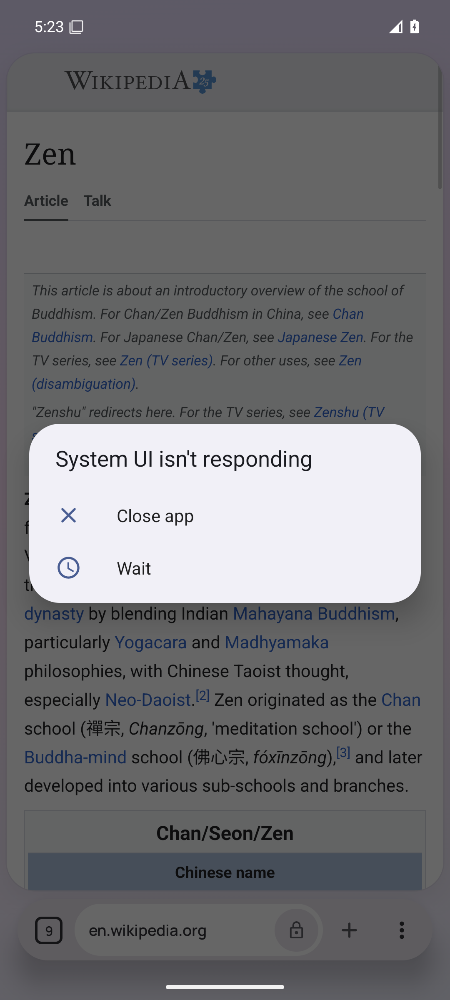

## 21-page-scrolled-ru

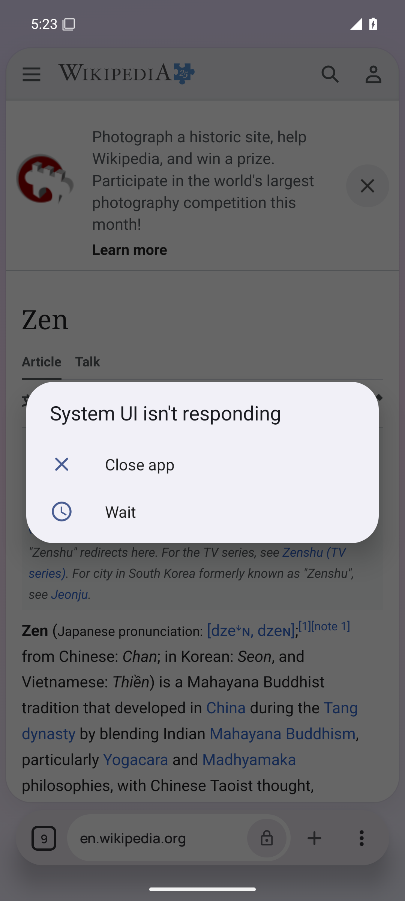

## 22-https-upgrade-ru

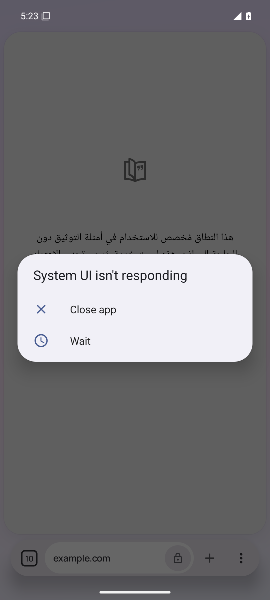

## 23-https-only-early-ru

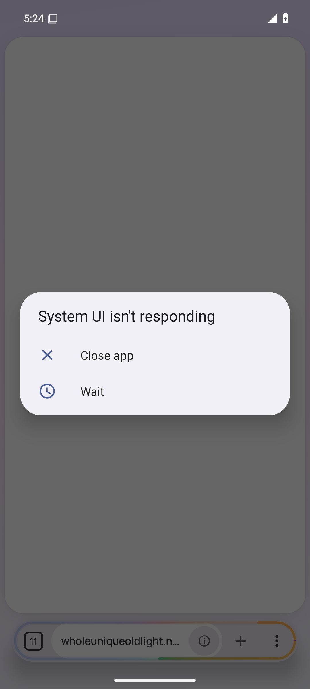

## 24-https-only-ru

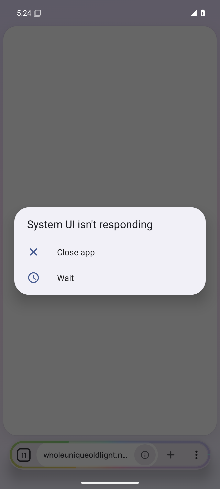

## 25-tab-overview-ru

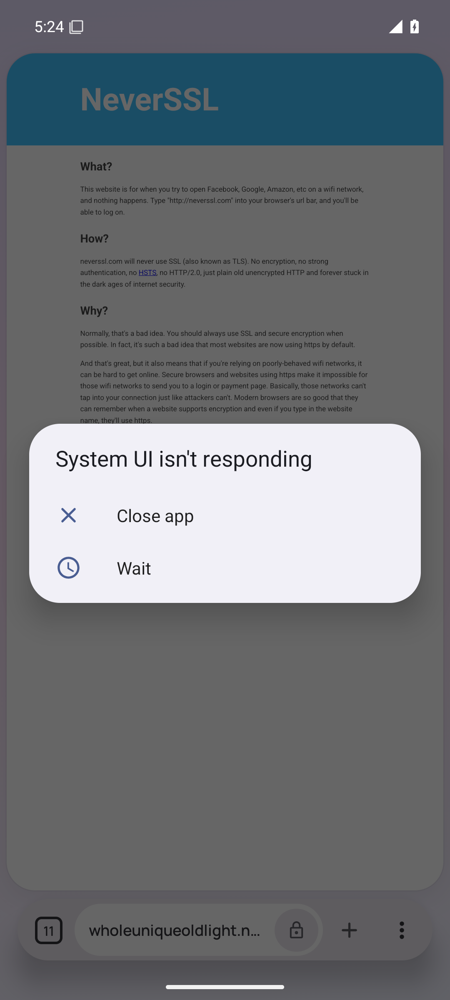

