# Screenshots: feat/https-only @ f451f2b

## 01-launch

## 02-new-tab-light

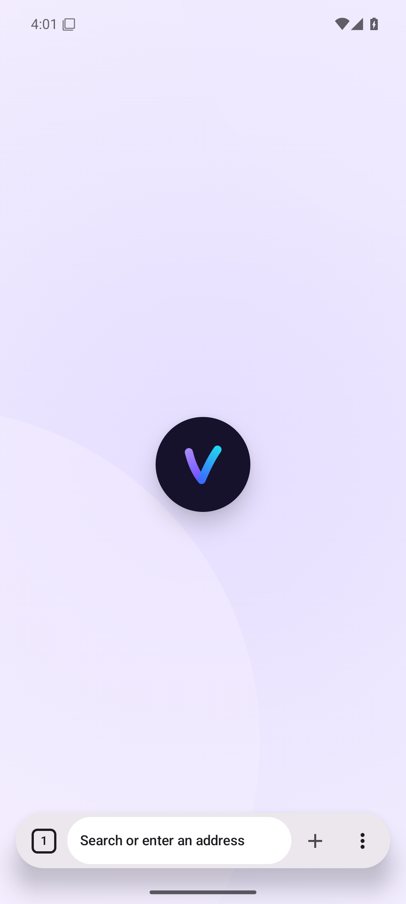

## 03-page-light

## 04-https-only-light

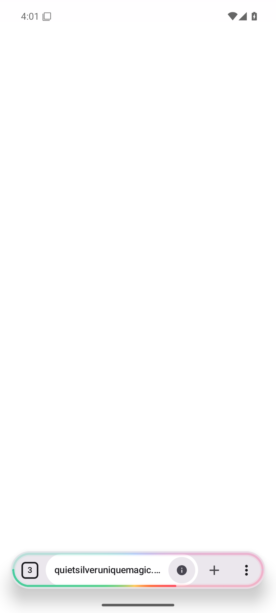

## 05-tab-overview-light

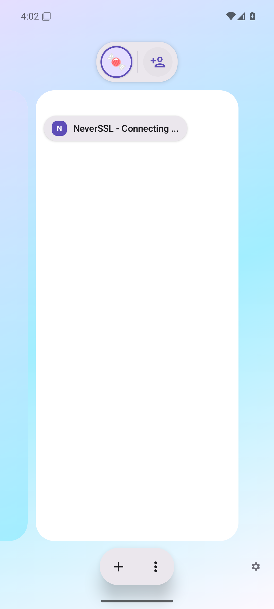

## 06-current-dark

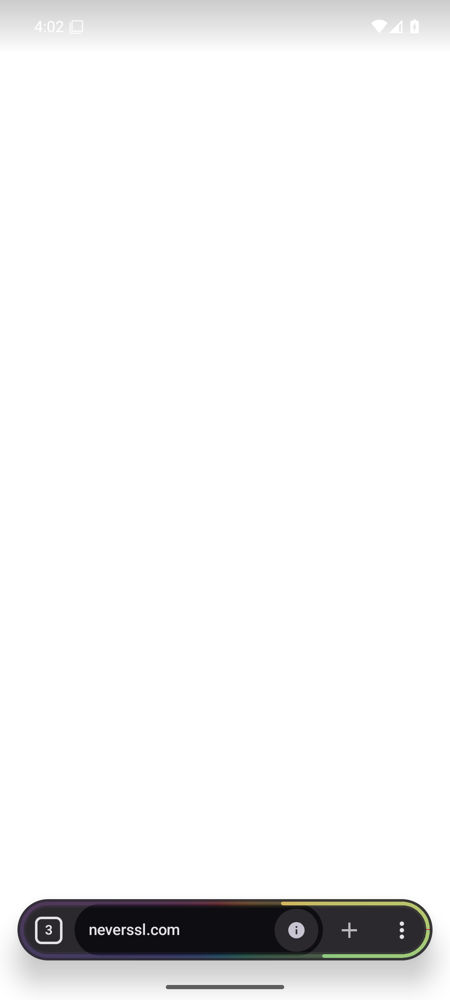

## 07-new-tab-dark

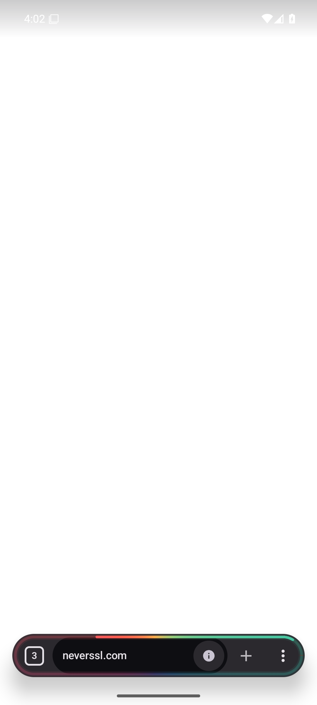

## 08-page-dark

## 09-https-only-dark

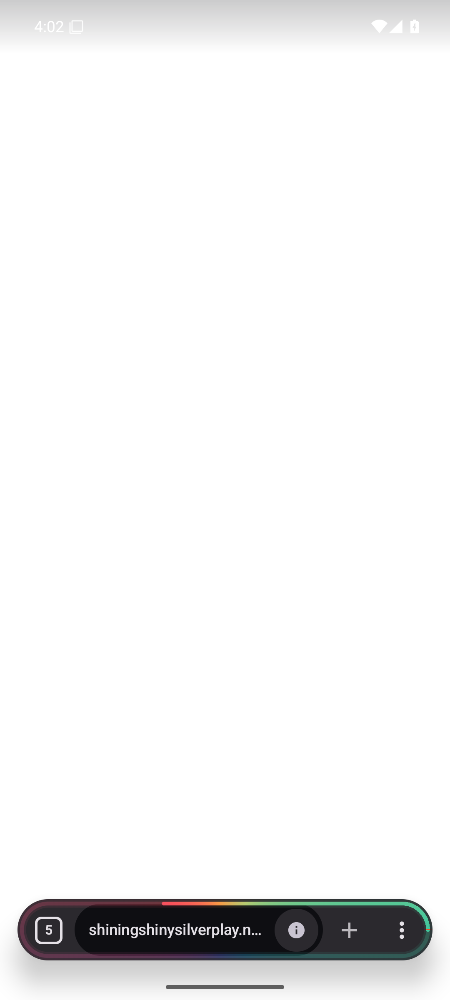

## 10-tab-overview-dark

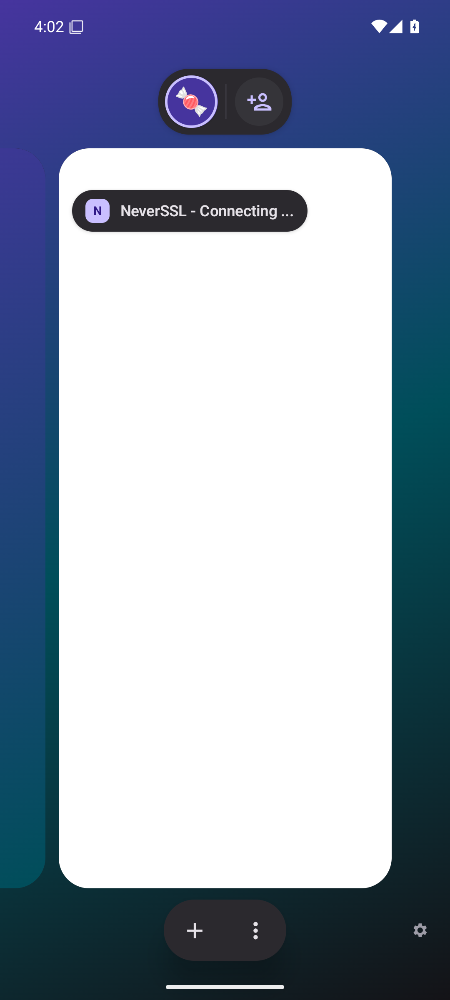

## 11-menu-dark

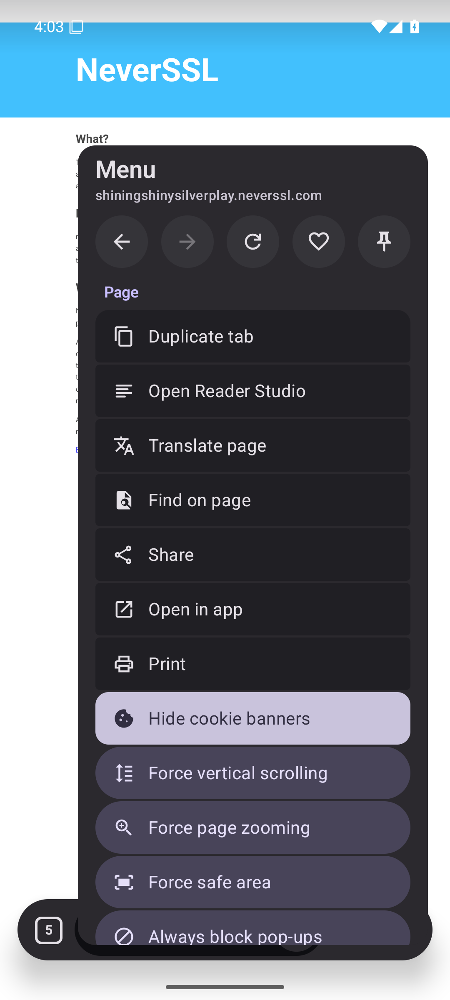

## 12-settings-dark

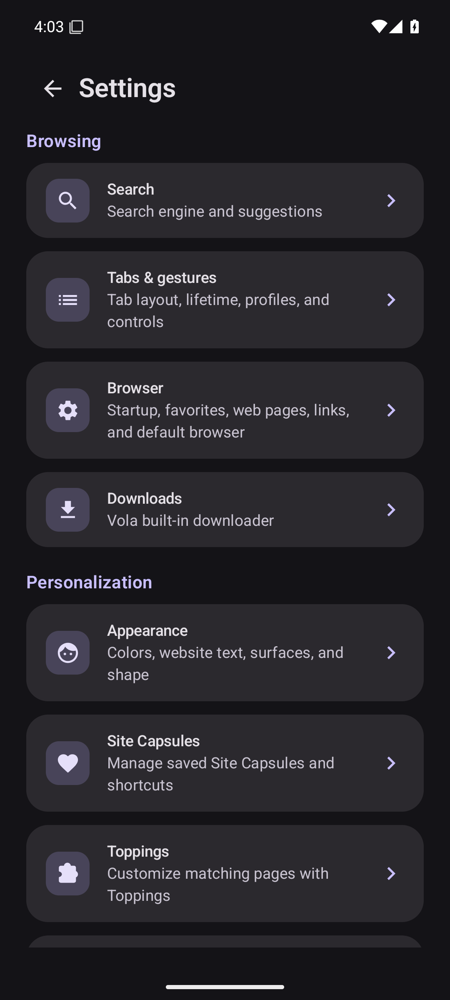

## 13-appearance-dark

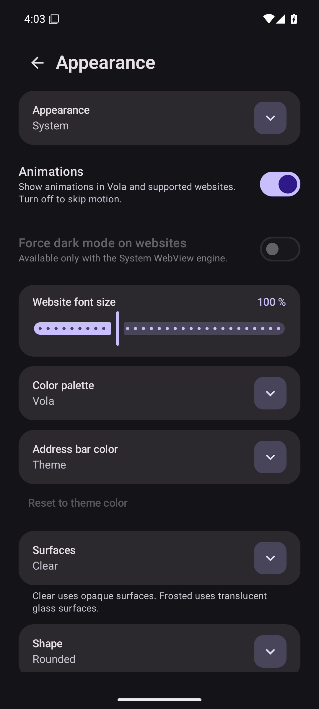

## 14-new-tab-ru

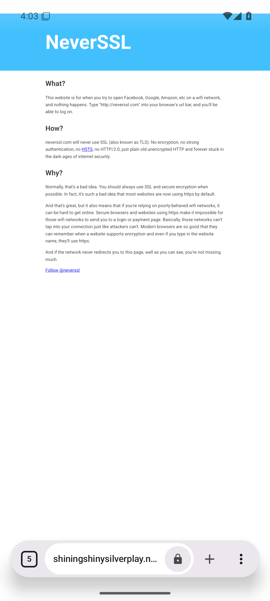

## 15-page-ru

## 16-https-only-ru

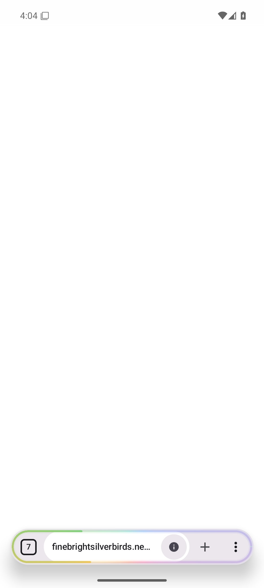

## 17-tab-overview-ru

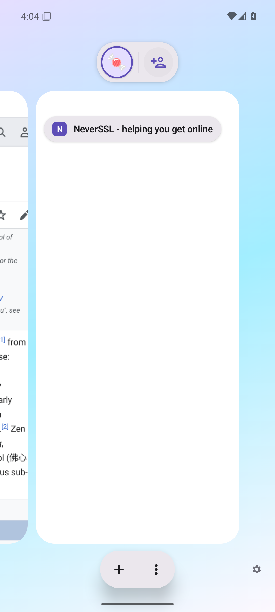

## 18-menu-ru

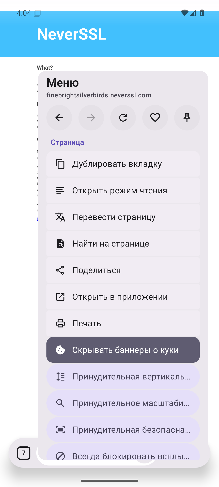

## 19-settings-ru

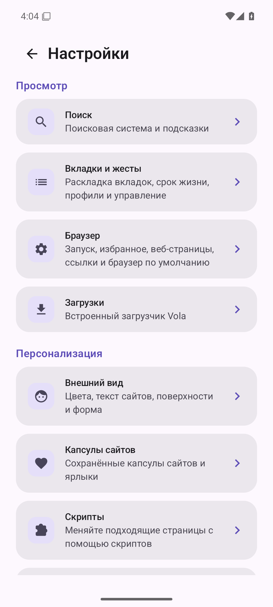

## 20-appearance-ru

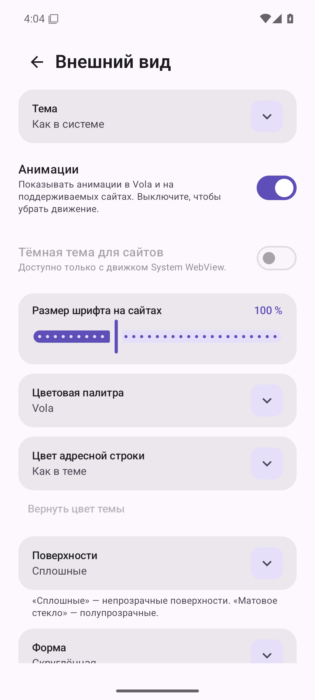

