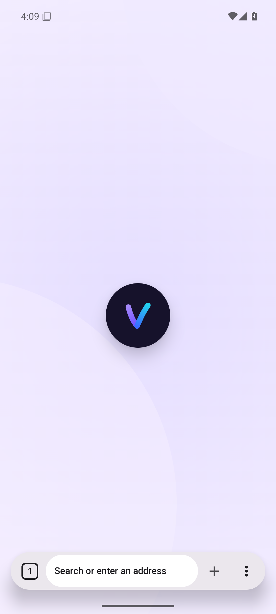
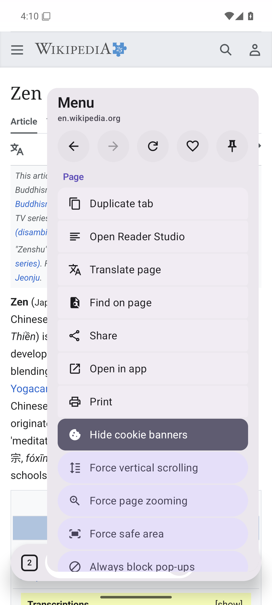
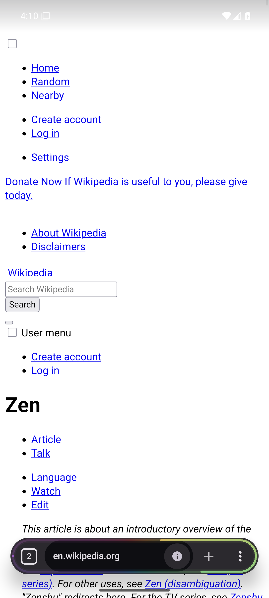
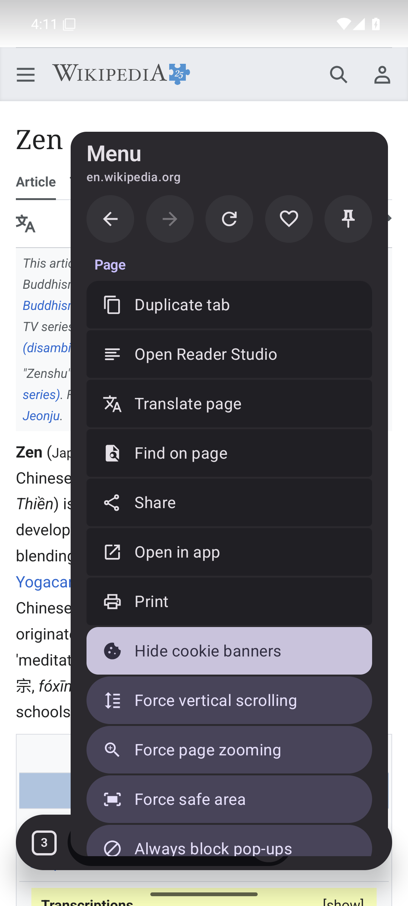
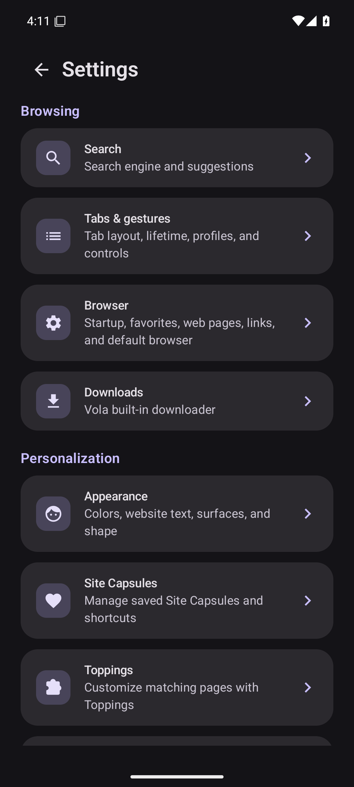
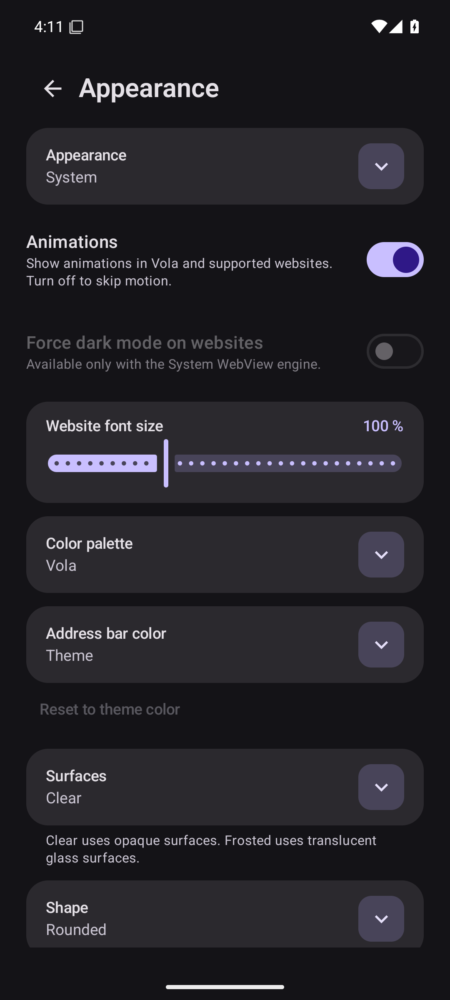
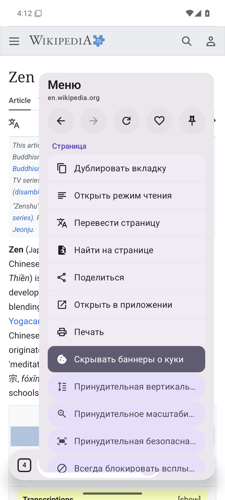
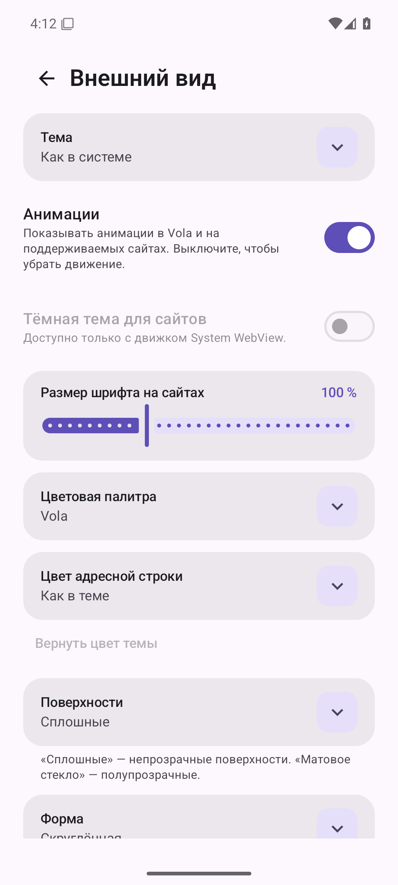

# Screenshots: feat/vola-palette @ bc6bc01

## 01-launch

## 02-new-tab-light

## 03-page-light

## 04-tab-overview-light

## 05-menu-light

## 06-current-dark

## 07-new-tab-dark

## 08-page-dark

## 09-tab-overview-dark

## 10-menu-dark

## 11-settings-dark

## 12-appearance-dark

## 13-new-tab-ru

## 14-page-ru

## 15-tab-overview-ru

## 16-menu-ru

## 17-settings-ru

## 18-appearance-ru

