# Screenshots: feat/vola-palette @ bd1d67f

## 01-launch

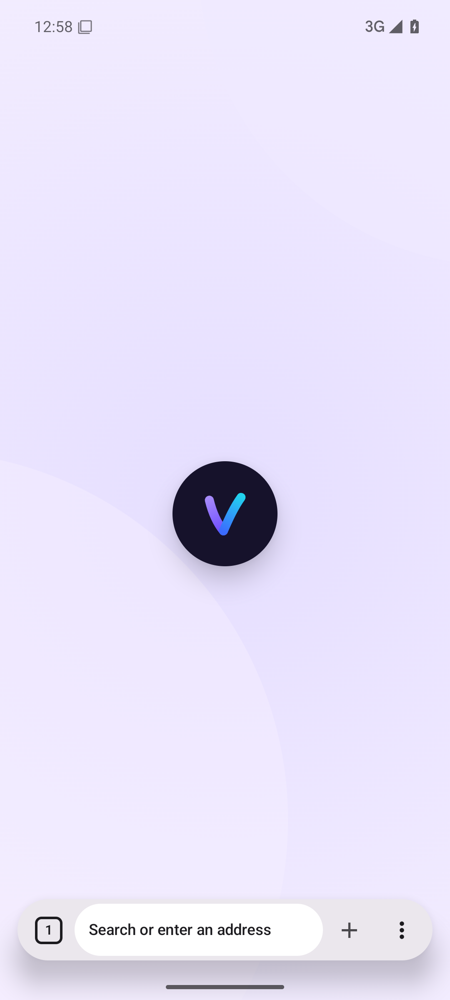

## 02-new-tab-light

## 03-page-light

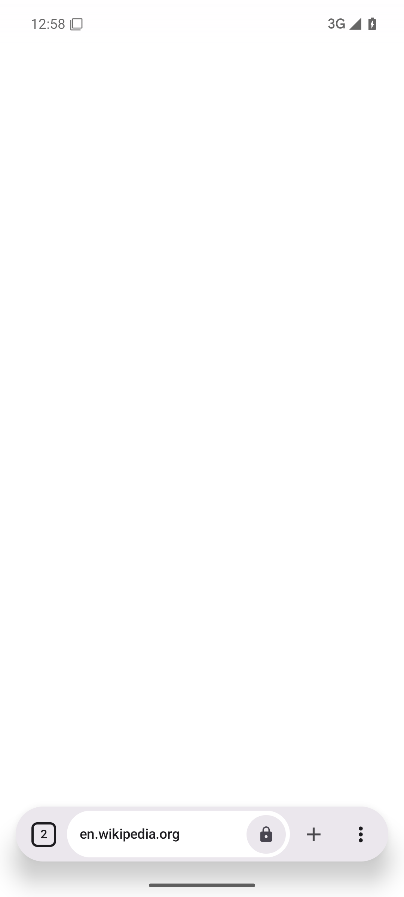

## 04-tab-overview-light

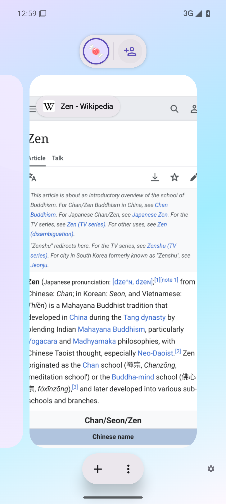

## 05-menu-light

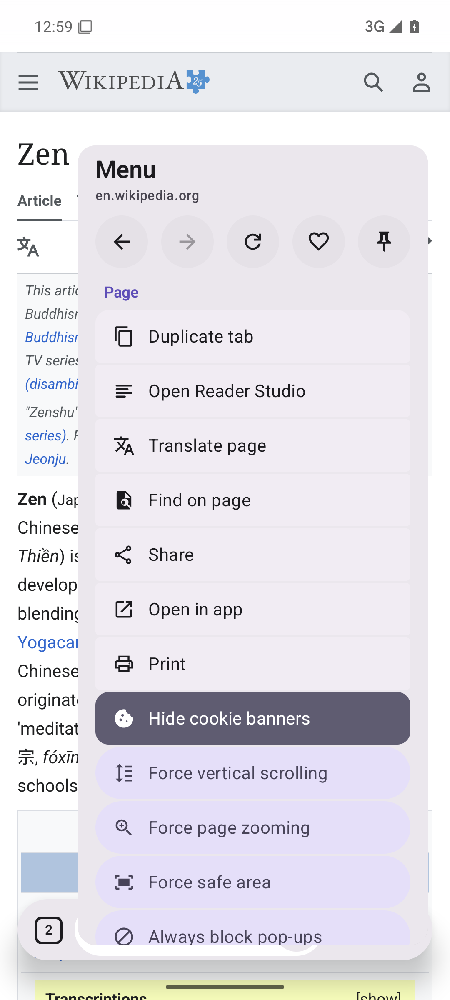

## 06-settings-light

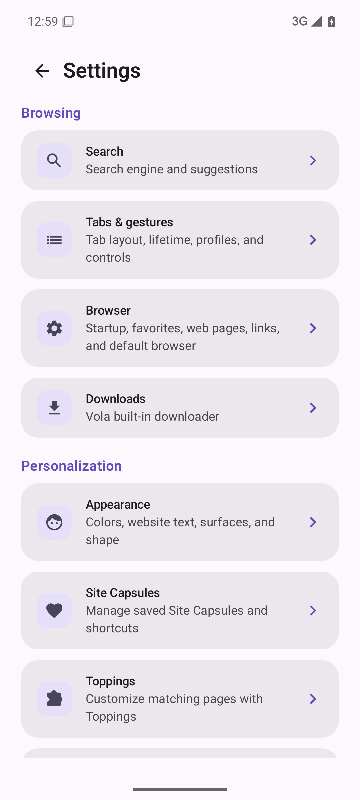

## 07-appearance-light

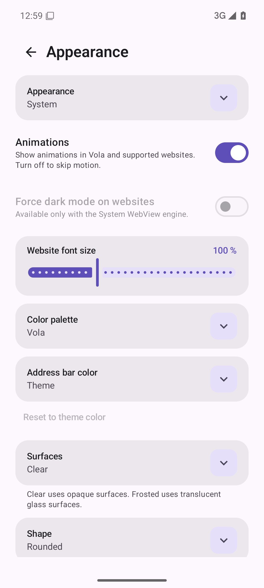

## 08-current-dark

## 09-new-tab-dark

## 10-page-dark

## 11-tab-overview-dark

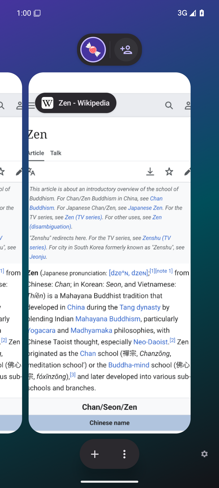

## 12-menu-dark

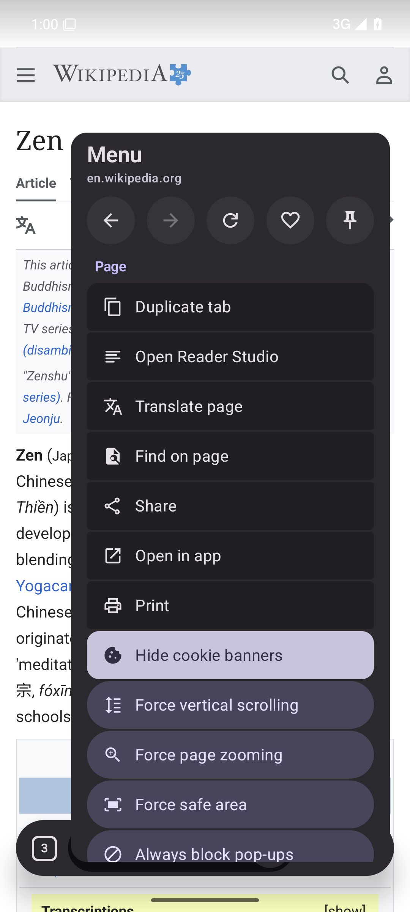

## 13-settings-dark

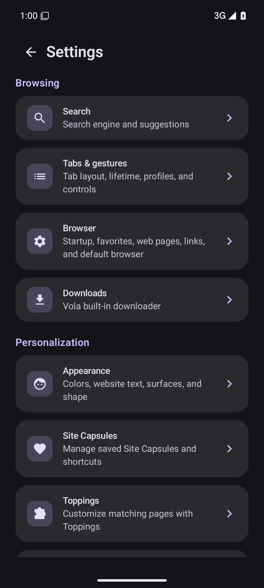

## 14-appearance-dark

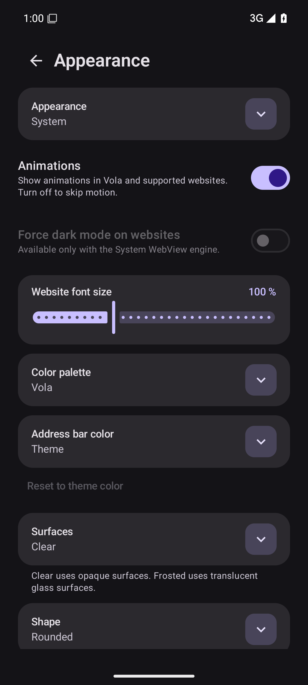

## 15-new-tab-ru

## 16-page-ru

## 17-tab-overview-ru

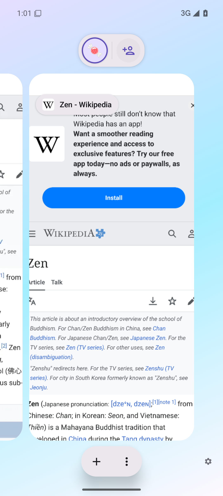

## 18-menu-ru

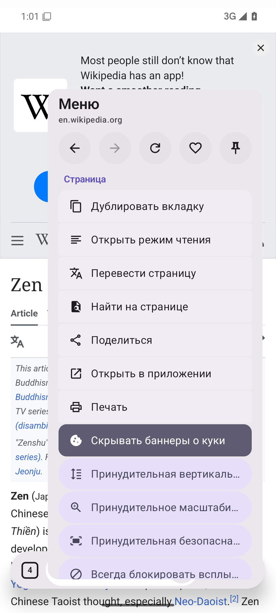

## 19-settings-ru

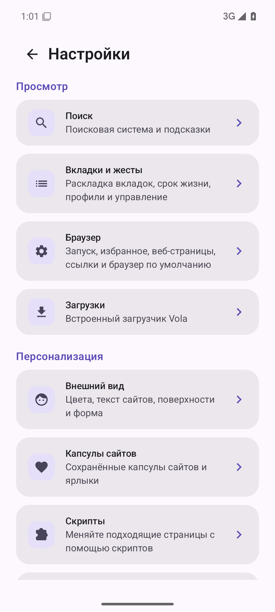

## 20-appearance-ru

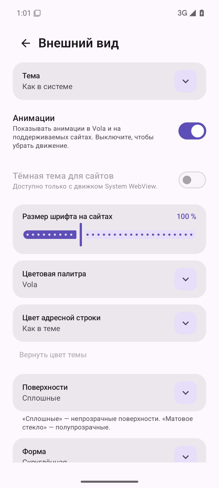

